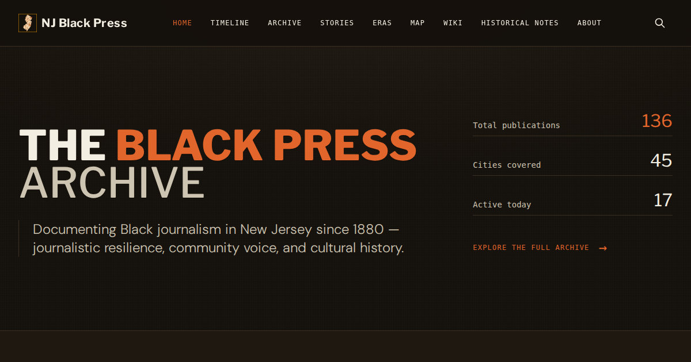

# NJ Black Press Archive

Historical archive of Black-owned and Black-focused publications in New Jersey
from 1880 to the present.

[View the live archive](https://centercoopmedia.github.io/njblackpress/)



The [Center for Cooperative Media](https://centerforcooperativemedia.org/) at
Montclair State University maintains the archive. The current dataset contains
more than 130 newspapers, magazines, newsletters, journals, and digital
publications.

## Explore the archive

| Section | Purpose |
|---|---|
| [Home](https://centercoopmedia.github.io/njblackpress/) | Featured publications, archive introduction, timeline, and search |
| [Archive](https://centercoopmedia.github.io/njblackpress/archive.html) | Filterable and sortable publication directory |
| [Stories](https://centercoopmedia.github.io/njblackpress/story.html) | Sourced narratives that connect publications and events |
| [Eras](https://centercoopmedia.github.io/njblackpress/era.html) | Historical periods and their publication activity |
| [Map](https://centercoopmedia.github.io/njblackpress/map.html) | Publication activity by place and decade |
| [Woven](https://centercoopmedia.github.io/njblackpress/woven.html) | Interactive loom view of the full publication timeline |
| [Wiki](https://centercoopmedia.github.io/njblackpress/wiki/) | Pre-rendered publication and browse pages |

Each publication record includes known dates, locations, publishers, formats,
archive links, historical notes, and supporting evidence when available.

## Technology

- Static HTML, CSS, and JavaScript
- Tailwind CSS 3, compiled into `docs/css/tailwind.css`
- Python data builders, generators, and checks
- Vendored Three.js modules for Woven
- GitHub Pages from `master` and the `docs/` directory

The project has no backend service, database server, or JavaScript framework.

## Repository map

```text
docs/                         Published GitHub Pages site
  data/                       Browser-ready data copies
  js/                         Site scripts and Woven modules
  wiki/                       Generated public HTML wiki
data/                         Source data, research, builders, and checks
  research/source-catalog.json
  research/rights/rights-manifest.json
okf/                          Generated portable markdown wiki
scripts/                      HTML and open knowledge format generators
src/input.css                 Tailwind input stylesheet
tailwind.config.js            Tailwind content paths and design tokens
```

Read [CODEBASE_OVERVIEW.md](CODEBASE_OVERVIEW.md) for the architecture and
[data/DATA_DICTIONARY.md](data/DATA_DICTIONARY.md) for the data contracts.

## Local development

Requirements:

- Node.js and npm
- Python 3

Install the locked Tailwind dependency and build the stylesheet:

```bash
npm ci
npm run build:css
```

Serve the published directory:

```bash
cd docs
python3 -m http.server 8000
```

Open `http://localhost:8000/`.

## Data and generated files

The repository keeps pipeline data under `data/` and browser copies under
`docs/data/`. Do not edit a browser copy without updating its source.

Important generated files include:

- `docs/css/tailwind.css`
- `docs/data/publications.json`
- `docs/data/featured-publications.json`
- `docs/data/events.json`
- `docs/data/stories.json`
- `docs/data/map-publications.json`
- `docs/data/clippings.json`
- `docs/images/evidence/`
- `docs/wiki/`
- `okf/`

Publication evidence comes from
`data/research/source-catalog.json`. Publication rights decisions come from
`data/research/rights/rights-manifest.json`. Do not publish an evidence file
unless its rights status permits that use.

Use the documented builder for each generated surface:

```bash
python3 data/add_evidence.py
cp data/featured-publications.json docs/data/featured-publications.json
cmp data/featured-publications.json docs/data/featured-publications.json
python3 data/build_site_events_stories.py
python3 data/build_map_data.py
python3 scripts/generate_html_wiki.py --base-url https://centercoopmedia.github.io/njblackpress/
python3 scripts/generate_okf_wiki.py
```

Run only the builders needed for the changed source. Review generated diffs
before you commit them.

The checked-in CSV is not a safe input for a routine publication change. Do
not run `data/convert_csv.py` unless you have a fresh Notion export and will
review the full dataset diff for lost editorial enrichment.

## Validation

Run the checks that match the changed area. Common checks include:

```bash
npm run build:css
python3 data/test_site_data.py
python3 data/test_source_catalog.py
python3 data/test_map.py
python3 data/test_navigation.py
python3 data/test_wiki_publications.py
python3 data/test_woven_layout.py
python3 data/test_woven_usability.py
python3 scripts/generate_okf_wiki.py --check
```

The evidence and source-catalog checks require the local evidence corpus under
`data/research/`. Git ignores most of those large research files. Run those
checks only in a checkout that has the corpus.

Visible changes also need browser checks at desktop and mobile sizes.

## Contributing

Read [CONTRIBUTING.md](CONTRIBUTING.md) before you change data or generated
files. Use the data correction issue form when you have a source for a missing
or incorrect fact.

## Citation and reuse

Credit the Center for Cooperative Media when you use archive data. This
repository does not currently include a software or data license file. Contact
the Center before you redistribute the dataset or evidence files.
