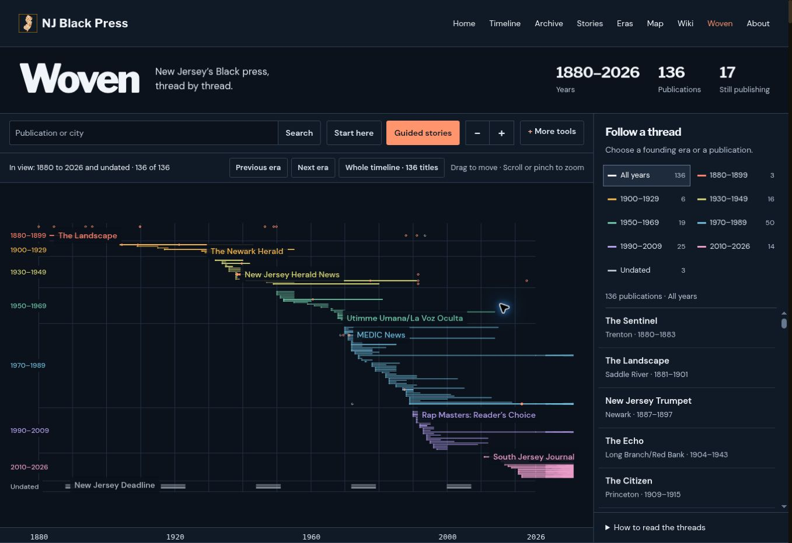
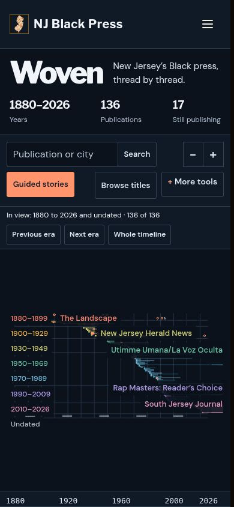

# Woven redesign review

The publication timeline now pairs a color-coded tapestry with direct era and
title browsing. Search, guided stories, evidence, publication links, and the
complete text alternative remain available. Faint threads describe display
rights, rather than claiming that no copies survive. Dashed spans mark unknown
end dates. Publications recorded for one year now produce visible ribbons.

The screenshots below show the Canvas 2D renderer at desktop and mobile sizes.
The browser used for this review did not support WebGL. The flat renderer uses
the same archive model, camera controls, picking, and story system; GPU shader
appearance still needs a check in a WebGL browser before merge.

Checks run:

- `npm run build:css`
- `node data/test_woven_model.mjs`
- `python3 data/test_woven_layout.py`
- `python3 data/test_woven_usability.py`
- `python3 data/test_navigation.py`
- `python3 data/test_site_data.py`
- JavaScript syntax checks and `git diff --check`
- Browser checks: desktop layout, 390px and 320px layouts, direct era selection,
  publication browsing, keyboard search, record links, story start/next/exit,
  and the text alternative.

The model check uses the real archive and additional missing-date cases. It
checks that each title produces geometry, that coordinates remain finite,
that dates and evidence remain unchanged, and that the flat renderer can draw
the complete model. Source data and evidence images are unchanged.

For development, `npm run dev` serves the static archive. Vite is a development
dependency only. Vendored Three.js files retain their integrity checks, and
GitHub Pages still publishes `docs/` directly.
